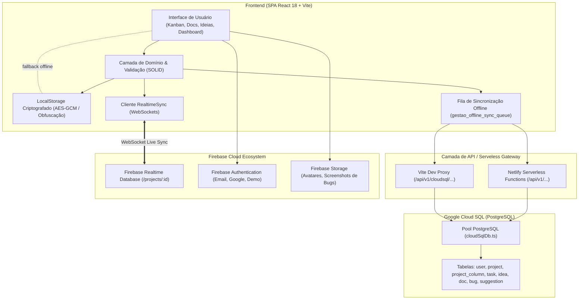
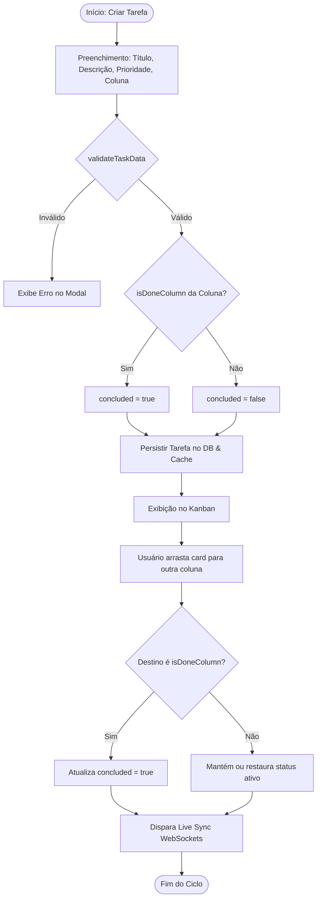
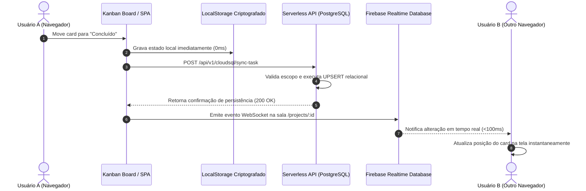
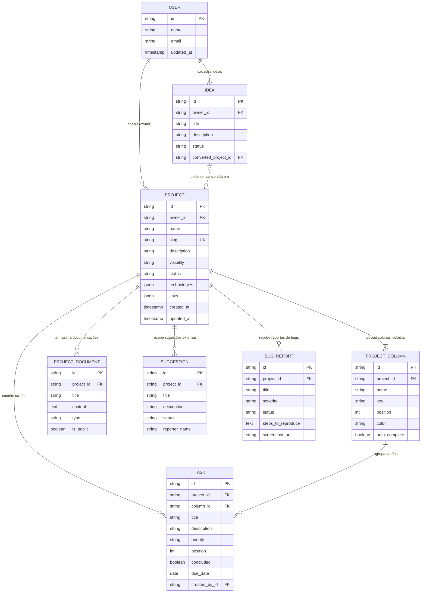

# Gestor de Projetos e Ideias 🚀

> **Hub de Desenvolvimento Ágil, Central de Ideias, Kanban Dinâmico, Documentação Markdown & Mermaid e API REST v1 para Integração de Feedbacks.**

---

## 📌 Visão Geral

O **Gestor de Projetos e Ideias** é uma plataforma moderna concebida para centralizar iniciativas de software, hipóteses de produtos e tarefas em equipe. O sistema funciona tanto como ferramenta privada de organização pessoal quanto como um portal público de projetos, permitindo que aplicações externas enviem sugestões e reportes de bugs diretamente para o projeto correspondente via API REST.

---

## 🛠️ Stack Tecnológica

- **Frontend:** [React 18](https://react.dev/) + [Vite](https://vitejs.dev/) + [TypeScript](https://www.typescriptlang.org/)
- **Estilização:** Vanilla CSS customizado com Glassmorphism, variáveis HSL, micro-animações táteis e tipografia [Google Fonts (Inter & Outfit)](https://fonts.google.com/)
- **Diagramação:** [Mermaid.js](https://mermaid.js.org/) para renderização visual em tempo real (Arquitetura C4, Fluxogramas, Sequência, ERD)
- **Backend / API Pública:** [Netlify Serverless Functions](https://www.netlify.com/products/functions/) versionada em `/api/v1` + endpoints de persistência Cloud SQL
- **Banco de Dados & Auth:** [Google Cloud SQL](https://cloud.google.com/sql) (PostgreSQL), [Firebase](https://firebase.google.com/) (Auth, Realtime Database, Storage) com sincronização local criptografada e live sync
- **Ícones:** [Lucide React](https://lucide.dev/)
- **Testes:** [Vitest](https://vitest.dev/) (62+ testes automatizados) + [Testing Library](https://testing-library.com/)

---

## 🏛️ Arquitetura do Sistema

O sistema combina uma arquitetura híbrida que prioriza **tempo de resposta instantâneo (0ms)** no cliente, persistência relacional consistente via **Google Cloud SQL (PostgreSQL)** e sincronização multi-dispositivo em tempo real via **Firebase Realtime Database (WebSockets)**.

### 📊 Diagrama de Arquitetura Geral (C4 Containers / Flow)



---

## 📐 Regras de Negócio Fundamentais

### 1. 🛡️ Isolamento Multi-Projeto & Integridade Referencial de Colunas
- **Escopo Estrito:** Toda coluna (`ProjectColumn`) pertence estritamente a um projeto (`c.projectId`). Colunas homônimas em projetos distintos (ex.: "Backlog", "Em Execução") são completamente independentes.
- **De-duplicação Composta:** Chaves de mapeamento e de-duplicação utilizam a chave composta `${projectId}:${key || slugify(name)}`. Isso impede que colunas de projetos diferentes sofram merge acidental.
- **Identificadores com Prefixo do Projeto:** Novas colunas são geradas com IDs no padrão `col_${projectId}_${slugify(name)}_${randomSuffix}`.
- **Exclusão Atômica e Proteção de Foreign Key (`task_column_id_fkey`):**
  - Ao excluir uma coluna, se houver `fallbackColumnId`, todas as tarefas são migradas no PostgreSQL (`UPDATE task SET column_id = $1 WHERE column_id = $2 AND project_id = $3`) antes da remoção da coluna.
  - Se não houver fallback, as tarefas vinculadas são removidas de forma controlada (`DELETE FROM task WHERE column_id = $1 AND project_id = $2`), prevenindo violações de chave estrangeira.
  - Exclusão com escopo duplo: `DELETE FROM project_column WHERE id = $1 AND project_id = $2`.

### 2. ⚡ Conclusão Automática e Ciclo de Vida de Tarefas
- **Unificação via `isDoneColumn`:** A regra que identifica colunas de conclusão está centralizada em `src/utils/columnUtils.ts`. Uma coluna é considerada de conclusão se:
  1. Possuir a flag `autoComplete: true`; ou
  2. Possuir chave técnica `key === 'done'`; ou
  3. Seu nome contiver o termo `"conclu"` (case-insensitive, cobrindo "Concluído", "Concluídas", "Finalizado").
- **Transição Automática:** Ao arrastar um card para uma coluna concluída ou selecioná-la no modal de edição, o campo `concluded` da tarefa é automaticamente definido como `true`. Se for movida para uma coluna de trabalho em andamento, o status se ajusta de acordo.
- **Ordenação Contínua (`position`):** Ao reordenar ou mover tarefas entre colunas, as posições são recalculadas sequencialmente (0, 1, 2, ...), evitando colisões de posição.

### 3. 💡 Conversão de Ideias em Projetos
- Ideias percorrem os estágios: `NOVA` ➔ `EM_ANALISE` ➔ `VALIDADA` ➔ `CONVERTIDA` (ou `ARQUIVADA`).
- Ao acionar a ação **"Converter em Projeto"**:
  1. Um novo `Project` é criado herdando título, descrição, tecnologias e visibilidade da ideia.
  2. Colunas Kanban padrão são automaticamente inicializadas (`Backlog`, `Em Execução`, `Concluído`).
  3. Um documento de arquitetura Markdown é auto-gerado.
  4. A ideia é atualizada para o status `CONVERTIDA` e recebe o identificador `convertedProjectId`, garantindo rastreabilidade bidirecional.

### 4. 🔐 Permissões, RBAC e Acesso Super Usuário
- **Matriz de Permissões de Projeto:**
  - `OWNER`: Controle total (edição de configurações, exclusão do projeto, gerenciamento de membros).
  - `EDITOR`: Criação, alteração e movimentação de atividades, documentos e moderação de feedbacks.
  - `VIEWER`: Acesso somente leitura às tarefas, documentações e diagramas.
- **Super Usuário:** Administradores identificados com papel de Super Usuário possuem acesso ao painel `/admin/super-user`, permitindo alterar temas globais da aplicação, inspecionar saúde da infraestrutura e gerenciar permissões no banco relacional.

### 5. 🔒 Privacidade de Links e Campos Sigilosos
- Projetos privados ou compartilhados não expõem URLs sensíveis ou repositórios Git no portal público `/p/:slug`.
- Visualização de links externos e anexos restrita a membros autenticados com credenciais válidas.

---

## 🔄 Fluxogramas e Diagramas de Processos

### 📋 Fluxograma: Ciclo de Vida e Movimentação de Tarefas



### 🔁 Diagrama de Sequência: Persistência Híbrida e Live Sync



### 💡 Fluxograma: Conversão de Ideia em Projeto


### 🗄️ Modelo Entidade-Relacionamento (ERD)



---

## 🧼 Princípios de Clean Code e SOLID Aplicados

| Princípio | Aplicação Prática no Projeto |
| :--- | :--- |
| **Single Responsibility (SRP)** | Regras de validação isoladas em `validationUtils.ts`, regras de conclusão em `columnUtils.ts`, estilo e metadados de prioridades em `taskUtils.ts`, e persistência isolada em `dbService.ts` e `cloudSqlDb.ts`. |
| **Open / Closed (OCP)** | O sistema de badges (`PriorityBadge`, `StatusBadge`) e temas é facilmente extensível para novas prioridades ou estados sem modificar as telas que os consom. |
| **Liskov Substitution (LSP)** | As fontes de dados (Cloud SQL PostgreSQL, Realtime Database e LocalStorage criptografado) operam sob contratos de tipos estritos (`Project`, `Task`, `ProjectColumn`). |
| **Interface Segregation (ISP)** | Interfaces finas e especializadas em `src/types/index.ts` evitam que componentes dependam de propriedades desnecessárias. |
| **Dependency Inversion (DIP)** | Componentes visuais dependem de abstrações de serviço (`ColumnService`, `TaskService`) e utilitários de domínio, desacoplados dos drivers nativos do banco. |
| **DRY (Don't Repeat Yourself)** | Centralização da checagem de conclusão de coluna (`isDoneColumn`) antes duplicada em 10 arquivos distintos; componentes reutilizáveis de UI (`PriorityBadge`, `ModalHeader`). |

---

## ✨ Funcionalidades Principais

### 1. 📊 Dashboard Central
- Métricas em tempo real (Projetos Ativos, Ideias no Backlog, Taxa de Conclusão, Feedbacks Pendentes).
- Listagem dos projetos recentes com barra de progresso de atividades por coluna.
- Acesso rápido para criação de projetos e anotação de ideias.

### 2. 🗂️ Módulo de Projetos
- CRUD completo de projetos com slug URL amigável (`/projects/:id` e `/p/:slug`).
- Filtros dinâmicos por visibilidade (**Público**, **Privado**, **Compartilhado**), status (**Em Andamento**, **Planejamento**, **Pausado**, **Concluído**, **Arquivado**) e tecnologias.
- Vínculo direto com repositórios Git (**GitHub**: url, branch principal, owner e repositório).
- Controle granular de membros e permissões (**Owner**, **Editor**, **Viewer**).

### 3. 📋 Kanban Dinâmico e Interativo
- Colunas isoladas por projeto com integridade referencial estrita.
- Colunas padrão (**Backlog**, **Em Execução**, **Concluído**) + criação de colunas personalizadas com seletor de cores e flag `autoComplete`.
- Remoção segura com remanejamento ou limpeza automática de atividades no Cloud SQL e Realtime Database.
- **Drag-and-Drop suave** entre colunas e reordenação interna.
- Atividades com título, descrição detalhada, prioridade com badge dedicado (**Baixa**, **Média**, **Alta**, **Urgente**), prazo de entrega e autor.
- Filtros instantâneos por texto de busca e prioridade.

### 4. 💡 Módulo de Ideias & Backlog
- Gestão de ideias em estágios: `NOVA`, `EM_ANALISE`, `VALIDADA`, `ARQUIVADA` e `CONVERTIDA`.
- Ação **"Converter em Projeto"**: cria um novo projeto com quadro Kanban e documentação preservando o histórico e vínculo bidirecional.

### 5. 📖 Documentação & Diagramas Mermaid
- Editor e visualizador Markdown com suporte a cabeçalhos, listas, blocos de código e alertas.
- Suporte a **diagramas Mermaid** interativos com templates prontos (Arquitetura Web, Fluxogramas, Diagramas de Sequência e Modelos ERD) e exportação em SVG.

### 6. 🌐 Portal Público & Feedbacks
- Página pública sem necessidade de login (`/p/:slug`) com visão geral, roadmap, documentação e diagramas públicos.
- Formulário público para **Sugestões** da comunidade (`/p/:slug/sugerir`).
- Formulário público para **Reporte de Bugs** (`/p/:slug/reportar-bug`) com anexo de imagens e detalhes de reprodução.
- Painel de moderação para o proprietário: aceitar, rejeitar, resolver ou transformar em atividade prioritária no Kanban com um clique.

### 7. ⚡ API Pública REST v1
Endpoints documentados e com rate limiting (60 req/min), CORS aberto e respostas JSON padronizadas:
- `GET /api/v1/projects/:slug` — Obter dados públicos de um projeto.
- `GET /api/v1/projects/:slug/suggestions` — Listar sugestões públicas.
- `POST /api/v1/projects/:slug/suggestions` — Enviar sugestão externa.
- `GET /api/v1/projects/:slug/bugs` — Listar reportes de bugs.
- `POST /api/v1/projects/:slug/bugs` — Enviar reporte de bug com anexo.
- `GET /api/v1/projects/:slug/docs` — Obter documentação pública.
- Documentação interativa e playground cURL acessível em `/docs/api`.

---

## 🚀 Como Executar Localmente

### Pré-requisitos
- [Node.js](https://nodejs.org/) v18+ ou v20+
- npm v10+

### Instalação e Execução

```bash
# 1. Clonar o repositório
git clone https://github.com/victor-reghini/Gestao-de-Projetos.git
cd Gestao-de-Projetos

# 2. Instalar dependências
npm install

# 3. Executar o servidor de desenvolvimento
npm run dev
```

Acesse no navegador: **`http://localhost:3000`**

### Executando os Testes Automatizados

```bash
# Executar suíte de testes Vitest
npm run test
```

### Build de Produção

```bash
# Validar tipagem TypeScript e gerar bundle otimizado
npm run build
```

---

## 🌐 Deploy na Netlify

O repositório já está configurado com `netlify.toml` pronto para deploy contínuo:

1. Conecte o repositório no dashboard da [Netlify](https://app.netlify.com/).
2. A Netlify executará automaticamente o comando `npm run build` e publicará a pasta `dist`.
3. As funções da API pública serão automaticamente publicadas a partir de `netlify/functions`.

---

## 📄 Licença

Distribuído sob a licença MIT. Consulte `LICENSE` para obter mais informações.
